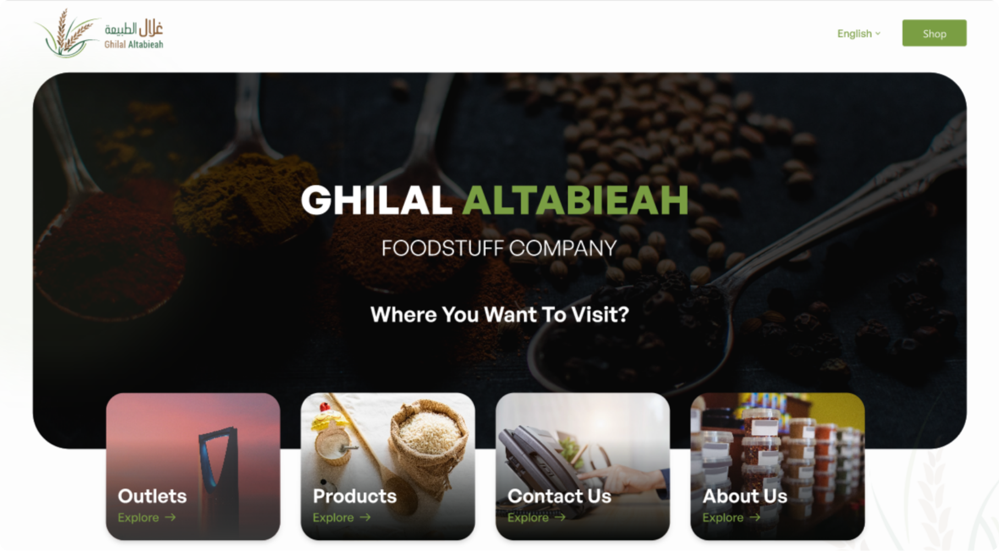
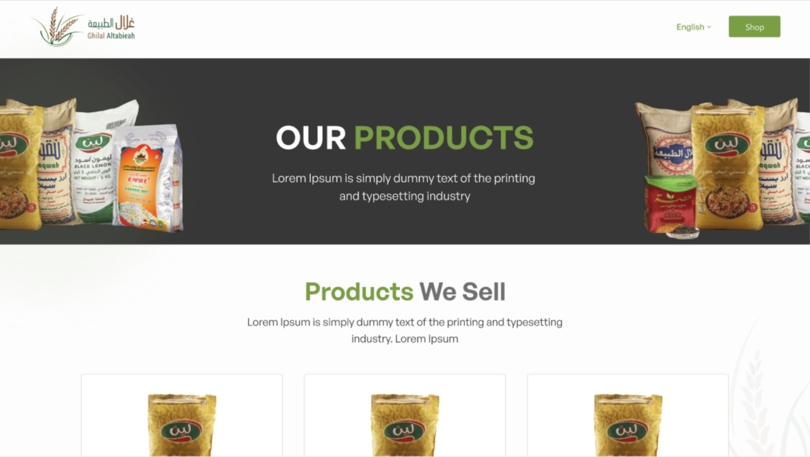
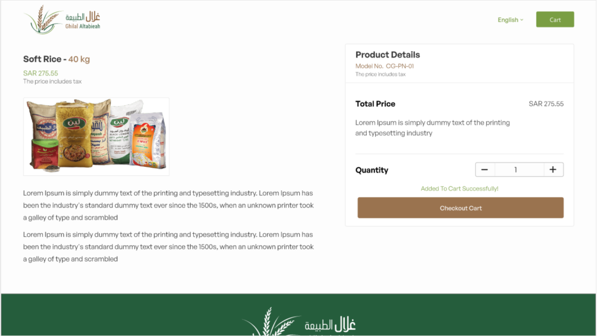
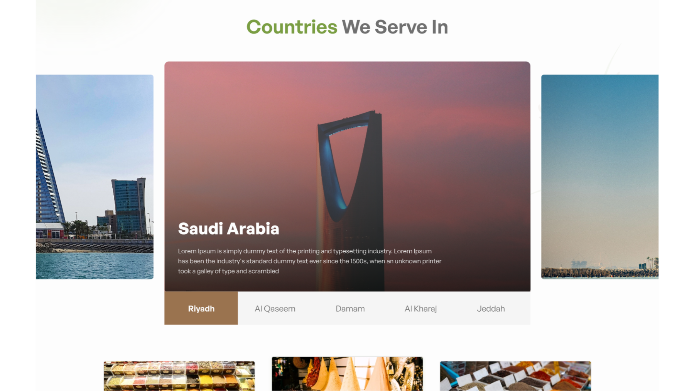

# Ghilal-Altaibieah
# Adva-Beauty

INTRODUCTION

Ghilal Altabieah is your trusted source for premium food products. Founded in 2012 in Riyadh, Saudi Arabia, we started our journey by importing a diverse range of essential food items from around the world, including India, Pakistan, Sudan, Sri Lanka, and Somalia. Our initial product line included rice, sesame seeds, tea, and dry lemon.

SYSTEM FEATURES

1. A well-organized menu and intuitive navigation system that makes it easy for visitors to find information about products, services, and company details.
2. A comprehensive product catalogue with high-quality images, detailed descriptions, and prices. Allow users to filter and search for products by category, brand, or other relevant criteria.
3. An integrated e-commerce platform where customers can add products to their cart, view their shopping cart, and securely complete transactions online.

TECNICALITIES/TOOLS USED

1. Reactjs
2. CDN
3. Siteground hosting

SYSTEM SCREENSHOTS

 

SYSTEM LINKS

Client Side: https://www.advabeauty.com/
